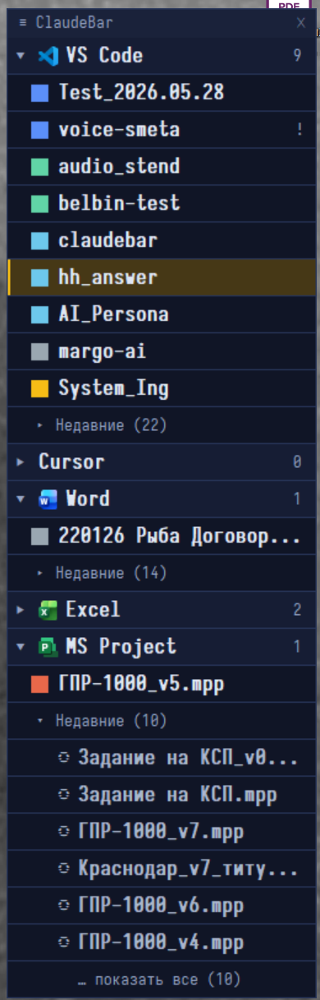

# ClaudeBar

A tiny always-on-top switcher for your open editor and Office windows — built for the moment you have **a dozen Claude Code sessions** and documents running in different windows and can no longer tell them apart.

It shows a compact vertical list of your windows, **grouped into collapsible sections by app** (VS Code, Cursor, Word, Excel, MS Project, **terminals** and **Explorer folders**). Click one to jump to it. Tag each project with a **color** and a **free-text label**. Under each section, a **recent documents** sub-list lets you reopen closed files in one click. And when an AI finishes in a project, ClaudeBar can **highlight that window's row** so you know where to look. The panel **font** is configurable from a gear menu.

Native Windows `.exe`, ~350 KB, written in Rust. No Python, no .NET, no runtime to install — one file.

<p align="center"></p>

```
┌────────────────────────┐
│ ≡ ClaudeBar        ⚙ ✕ │   ← ⚙ opens settings (panel font)
│ ▼ 🅥 VS Code         2 │   ← app section with icon + window count
│ ▌ ConstructMan    opus │   ← color swatch · project · label
│ ▌ Test_2026.05  sonnet▕│   ← gold bar = AI just finished here (bell)
│   ▾ Недавние (3)       │   ← recent docs sub-list
│   ◌ old_branch.md      │
│   … показать все (12)  │   ← expand beyond the first 6
│ ▼ 🅦 Word            1 │
│ ▌ Договор.docx       ✕ │   ← hover a window → ✕ closes it
└────────────────────────┘
```

## Why

When you run many Claude Code sessions, each lives in its own editor window. The taskbar and Alt-Tab show near-identical entries, and you waste time hunting for the right one. ClaudeBar gives every project a stable spot, a color, a label, an app section, and switches to it in one click — and tells you which project the AI just finished.

## Features

- Always-on-top vertical bar, lists every window of a known editor/Office process (VS Code, Cursor, Word, Excel, MS Project), plus **terminals** (Windows Terminal, Command Prompt, PowerShell, Git Bash) and **Explorer folders** — each its own section.
- **Collapsible sections per app**, each with its icon and a window count. Collapse state is remembered.
- Groups by **project name**, not the active file — the row stays put when you switch files.
- **Bell:** when an AI finishes in a project (via a Claude Code `Stop` hook), the project's row is highlighted with a warm gold bar; the highlight clears once that window gets focus.
- **Recent documents** per section (from Windows Recent + editors' workspace storage): reopen a closed file in one click. The first 6 are shown, with a **"show all"** toggle for the rest.
- **Left-click** a window row → switch to it (restores it if minimized).
- **Close button (✕)** on hover → closes that window the normal way (the app shows its own save prompt).
- **Right-click** a window row → context menu: **copy the path** or **open the location in Explorer** (a project → its folder, a document → the file itself), pick a color (8 presets) and set a label.
- **Reorder:** right-click a section header to enter reorder mode, then drag rows to set your own order of sections and windows. Order persists.
- **Settings (⚙):** click the gear in the header to pick the panel **font** via the native font dialog — face, size and weight. Saved to `claudebar.ini`.
- Color + label are bound to the **project name**, so they survive switching files and reopening the window. Stored in `claudebar.ini` next to the exe.
- Drag the panel by its header; position is remembered.
- Auto-refreshes about once a second — new windows appear, closed ones disappear.

## Bell — "AI finished" highlight

ClaudeBar can highlight the row of the project where Claude Code just finished. It works through a tiny `Stop` hook that writes a signal file; ClaudeBar polls it and matches by project name (the `cwd` folder name).

1. The hook script ships in `hooks/claudebar-bell.ps1`.
2. Wire it into `~/.claude/settings.json` (`hooks.Stop`) — run the installer once:

   ```
   powershell -ExecutionPolicy Bypass -File "hooks\install-bell-hook.ps1"
   ```

   It backs up `settings.json` and adds the hook idempotently.
3. From then on, finishing an AI turn in a project open in VS Code / Cursor highlights its row; the highlight clears when you focus the window.

Highlighting works for projects open in a tracked editor window (the typical case: Claude in an integrated terminal). See `hooks/README.md`.

## Install

**Option A — download.** Grab `claudebar.exe` from [Releases](https://github.com/Baho73/claudebar/releases), drop it anywhere, run it.

**Option B — build from source** (see below).

> **Antivirus note.** ClaudeBar is an unsigned binary that enumerates windows and changes focus (`SetForegroundWindow`). Some antivirus engines (e.g. Kaspersky) flag that behavior heuristically and may quarantine it. If the exe vanishes or won't start, add it (or its folder) to your AV's trusted/exclusions list. The source is right here — read it, build it yourself if you prefer.

## Usage

- **Left-click** a window row — focus that window.
- **Hover** a window row, click **✕** on the right — close that window (the app asks to save if needed).
- **Right-click** a window row — context menu: **Copy link** and **Open in Explorer** (project → its folder; document → the file, opened with Explorer selecting it; greyed when the path can't be resolved), 8 colors, **Метка… / Label…**, **Убрать метку / Clear label**.
- **Click a section header** — collapse / expand the app section.
- **Right-click a section header** — toggle **reorder mode**; the header turns gold. Drag any row to reorder sections and windows. Right-click a header again to exit.
- **Recent sub-list** — click **▾ Недавние** to expand, click a document to reopen it, **… показать все** to see more than 6.
- **Drag** the header strip to move the panel. **✕** in the header — quit.

## How it finds windows

ClaudeBar lists top-level visible windows that belong to a known editor/Office **process**. Built-in set:

```
code.exe              → VS Code
cursor.exe            → Cursor
winword.exe           → Word
excel.exe             → Excel
winproj.exe           → MS Project
windowsterminal.exe   → Windows Terminal
cmd.exe               → Command Prompt    (ConsoleWindowClass)
powershell/pwsh.exe   → PowerShell        (ConsoleWindowClass)
mintty.exe / bash.exe → Git Bash
explorer.exe          → Explorer folders  (CabinetWClass only)
```

The **project name** is extracted from the window title per app: for VS Code / Cursor it is the segment just before the ` - Visual Studio Code` / ` - Cursor` suffix; for Office apps it is the document name; for terminals and Explorer folders it is the whole title. Section icons are taken from each app's exe file.

Matching is by process **and**, where needed, **window class**: Explorer folders are taken only from `CabinetWClass` windows (so the taskbar and desktop are excluded), and consoles from `ConsoleWindowClass`. Because a classic console window is owned by `conhost`, cmd vs PowerShell is resolved by walking the console host's process tree to the real shell. The tracked set is built in; there is no user-editable pattern list yet — see BACKLOG.

## Recent documents

Each section can show recently used files of that app, so a just-closed document is one click away:

- **Office** files come from Windows Recent (`%APPDATA%\Microsoft\Windows\Recent\*.lnk`), filtered by extension (`.docx`→Word, `.xlsx`→Excel, `.mpp`→MS Project).
- **Editor** projects come from VS Code / Cursor workspace storage.
- Files currently open are excluded; click one and it opens via `ShellExecute`, then moves from "recent" into the live window list on the next poll.

## Config file (`claudebar.ini`)

Created automatically next to the exe. Plain text:

```
# claudebar config
pos=1570,40
font=Iosevka Fixed	16	600
c=Excel
re=Word
ra=Word
os=Cursor	VS Code	Word
o=VS Code	ConstructMan	Test_2026.05.28
p=ConstructMan	3	opus
```

- `pos=X,Y` — panel position.
- `font=<face>\t<size>\t<weight>` — panel font: face, pixel size, weight (100–900). Editable from the ⚙ menu; default `Iosevka Fixed` 16 600.
- `c=<block>` — collapsed section (by app block name).
- `re=<block>` — section with the "recent" sub-block expanded.
- `ra=<block>` — section with "show all" recent enabled (beyond the first 6).
- `os=<block>\t<block>…` — manual order of sections.
- `o=<block>\t<name>\t<name>…` — manual order of windows within a section.
- `p=<project>\t<colorIndex 0-7>\t<label>` — per-project settings (tab-separated; color `-1` means auto).

## Build from source

Needs Rust. Without Visual Studio, use the self-contained GNU toolchain:

```powershell
# install rustup with the GNU toolchain
rustup-init.exe -y --default-host x86_64-pc-windows-gnu --default-toolchain stable

# build
cargo build --release
# -> target\release\claudebar.exe
```

Dependencies: [`windows`](https://crates.io/crates/windows) (Win32),
[`rusqlite`](https://crates.io/crates/rusqlite) (bundled SQLite/FTS5),
[`serde_json`](https://crates.io/crates/serde_json) (transcript parsing), and
[`calamine`](https://crates.io/crates/calamine) / [`zip`](https://crates.io/crates/zip) /
[`pdf-extract`](https://crates.io/crates/pdf-extract) (file-content extraction). All pure Rust
except SQLite — builds under the GNU toolchain.

> **C compiler for the GNU toolchain.** `rusqlite`'s bundled SQLite is C, so the build needs a
> mingw-w64 **gcc on `PATH`** (the Rust GNU toolchain ships only a linker, not a C compiler).
> Install [MSYS2](https://www.msys2.org/) or [w64devkit](https://github.com/skeeto/w64devkit) and add
> its `mingw64\bin` to `PATH` before `cargo build`. A gcc 14.x (matching Rust's bundled mingw) links
> cleanly; a bleeding-edge gcc 16 needs `-C link-self-contained=yes`.

### Search (native, no Python)
The in-panel search box indexes and queries entirely in Rust — no external service.

- **Self-indexing.** On startup (and every ~3 min) a background thread builds a local FTS5 index
  from your Claude Code transcripts (`~/.claude/projects/**/*.jsonl`) into
  `%APPDATA%\claudebar\claudebar_chats.db`. Incremental by mtime; fresh chats become searchable
  on their own.
- **Live BM25** as you type (from the 3rd character). Query syntax: space = AND, `a+b` = exact
  phrase, `a++b` = NEAR, `-word` = exclude, `OR` = or; IP/path/date are matched as a phrase.
- **`+Files` (⚙ menu).** Also indexes documents from Windows history (Recent) into
  `claudebar_files.db` — text/markdown/code/`.xer` directly, `.xlsx/.xls` via calamine,
  `.docx/.pptx` via zip+xml, `.pdf` via pdf-extract.
- **Hover tooltips** (~0.5 s) show the full path, the matching snippet for chat results, and the
  query-syntax rules over the search box.
- **Search box niceties:** a **✕** inside the field clears it; clicking the empty field drops down a
  **recent-queries** list (type, pick with the mouse, or arrow-key + Enter). History is saved when a
  search completes — on clear or when focus leaves the field.

Semantic (dense / "by meaning") search is deferred to an optional future Python module; the
companion `clfind` tool remains frozen for that.

## Limitations

- Switches between **windows**. If you run several Claude Code sessions in tabs inside one editor window, they can't be told apart by window — one session per window is the supported setup.
- The bell highlights projects open in a tracked editor window; if Claude runs in an external terminal and the project isn't open in an editor, there's nothing to highlight.
- Windows only (Win32).

## License

MIT — see [LICENSE](LICENSE).

---

## По-русски

Крошечная всегда-поверх панель для тех, у кого открыто много окон редакторов и Office и кто тонет в них — особенно когда параллельно крутится **десяток сессий Claude Code**.

Показывает компактный вертикальный список окон, **сгруппированных в сворачиваемые секции по приложению** (VS Code, Cursor, Word, Excel, MS Project, **терминалы** и **папки Проводника**). Клик — переключиться на окно. Каждому проекту можно задать **цвет** и **текстовую метку**. Под секцией — список **недавних документов** для повторного открытия одним кликом. А когда ИИ заканчивает работу в проекте, ClaudeBar **подсвечивает строку** этого окна, чтобы сразу было видно, куда смотреть. **Шрифт** панели настраивается из меню-шестерёнки.

Нативный `.exe` ~350 КБ на Rust, без зависимостей, без установки.

### Что умеет

- Всегда-поверх список окон известных процессов; **секции по приложению** с иконкой и счётчиком, сворачивание сохраняется. Помимо редакторов и Office — **терминалы** (Windows Terminal, командная строка, PowerShell, Git Bash) и **папки Проводника** отдельными секциями.
- Группировка по **имени проекта**, а не по активному файлу — строка не прыгает при смене файла.
- **Звоночек:** когда ИИ закончила работу (через `Stop`-хук Claude Code), строка проекта подсвечивается тёплой золотой полосой; подсветка гаснет, когда окно получает фокус.
- **Недавние документы** в каждой секции (Windows Recent + хранилище проектов редакторов): первые 6 и крыжик **«показать все»**.
- **ЛКМ** по окну — переключиться (восстановит из свёрнутого).
- **Кнопка ✕** при наведении — закрыть окно штатно (приложение само спросит про сохранение).
- **ПКМ** по окну — контекстное меню: **скопировать ссылку** и **открыть в проводнике** (проект → его папка; документ → сам файл, Проводник открывается с выделением файла; пункты серые, если путь не определить), цвет (8) и метка.
- **Перетаскивание:** ПКМ по заголовку секции включает режим порядка, тащи строки — меняешь порядок секций и окон. Порядок сохраняется.
- **Настройки (⚙):** шестерёнка в шапке открывает нативный выбор **шрифта** панели (гарнитура, кегль, насыщенность); сохраняется в `claudebar.ini` (ключ `font=`).
- Цвет и метка привязаны к имени проекта, переживают смену файла и перезапуск окна. Конфиг `claudebar.ini` рядом с exe.

### Звоночек — настройка

Подсветку «ИИ закончила» включает `Stop`-хук Claude Code, который пишет файл-сигнал; ClaudeBar опрашивает его и сопоставляет по имени проекта (имя папки `cwd`). Скрипт — `hooks/claudebar-bell.ps1`. Подключить одной командой:

```
powershell -ExecutionPolicy Bypass -File "hooks\install-bell-hook.ps1"
```

Команда делает бэкап `settings.json` и добавляет хук (идемпотентно). Подробности — `hooks/README.md`.

### Антивирус

Запуск может блокировать антивирус (Касперский считает подозрительным неподписанный exe, который переключает фокус окон) — добавь exe или папку в исключения. Исходники открыты — можно собрать самому.
