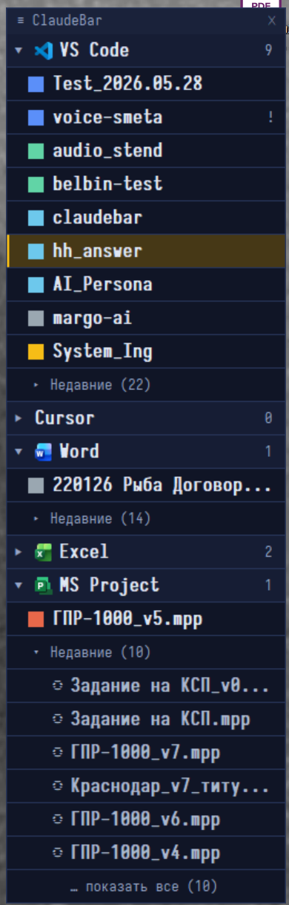

# ClaudeBar

A tiny always-on-top switcher for your open editor and Office windows — built for the moment you have **a dozen Claude Code sessions** and documents running in different windows and can no longer tell them apart.

It shows a compact vertical list of your windows, **grouped into collapsible sections by app** (VS Code, Cursor, Word, Excel, MS Project, **terminals** and **Explorer folders**). Click one to jump to it. Tag each project with a **color** and a **free-text label**. Under each section, a **recent documents** sub-list lets you reopen closed files in one click. Small **status squares** on each row show what your AI agents are doing right now — one square per live session, per agent. A **search box** finds anything you ever discussed, across all your chat transcripts. And a global hotkey turns **speech into text** in whatever field you're typing in.

Native Windows `.exe`, ~2.8 MB, written in Rust. No Python, no .NET, no runtime to install — one file.

<p align="center"></p>

```
┌────────────────────────┐
│ ≡ [ search… ]      ⚙ ✕ │   ← search box; ⚙ opens settings
│ ▼ 🅥 VS Code         2 │   ← app section with icon + window count
│ ▌ ConstructMan ▫▪ opus │   ← color swatch · project · squares · label
│ ▌ Test_2026.05  sonnet▕│   ← gold bar = AI just finished here (bell)
│   ▾ Недавние (3)       │   ← recent docs sub-list
│   ◌ old_branch.md      │
│   … показать все (12)  │   ← expand beyond the first 6
│ ▼ 🅦 Word            1 │
│ ▌ Договор.docx       ✕ │   ← hover a window → ✕ closes it
├────────────────────────┤
│ ⚠ Whisper не запущен   │   ← only when the dictation server is down
└────────────────────────┘
```

## Why

When you run many Claude Code sessions, each lives in its own editor window. The taskbar and Alt-Tab show near-identical entries, and you waste time hunting for the right one. ClaudeBar gives every project a stable spot, a color, a label, an app section, and switches to it in one click — and tells you which project the AI just finished, which ones are still working, and where you once discussed that thing you half-remember.

## Features

- Always-on-top vertical bar, lists every window of a known editor/Office process (VS Code, Cursor, Word, Excel, MS Project), plus **terminals** (Windows Terminal, Command Prompt, PowerShell, Git Bash) and **Explorer folders** — each its own section.
- **Collapsible sections per app**, each with its icon and a window count. Collapse state is remembered.
- Groups by **project name**, not the active file — the row stays put when you switch files.
- **Status squares:** one small square per live agent session on the project's row — outlined when idle, an outline with **marching dots** running around it while the agent works, and a steady **gold fill** when it's done. Claude is teal, Kimi is violet, and the order is stable (Claude left, Kimi right).
- **Bell:** when an AI finishes in a project, the project's row is highlighted with a warm gold bar; the highlight clears once that window gets focus.
- **Search** across all your Claude Code transcripts (and optionally your documents) from the box in the header — see [Search](#search-native-no-python).
- **Voice dictation:** a global hotkey records you and pastes the recognized text into whatever field you were typing in — see [Voice dictation](#voice-dictation).
- **Recent documents** per section (from Windows Recent + editors' workspace storage): reopen a closed file in one click. The first 6 are shown, with a **"show all"** toggle for the rest.
- **Left-click** a window row → switch to it (restores it if minimized).
- **Close button (✕)** on hover → closes that window the normal way (the app shows its own save prompt).
- **Right-click** a window row → context menu: **copy the path** or **open the location in Explorer** (a project → its folder, a document → the file itself), pick a color (8 presets) and set a label.
- **Reorder:** right-click a section header to enter reorder mode, then drag rows to set your own order of sections and windows. Order persists.
- **Settings (⚙):** panel font (native dialog), search scope, editor title format, window sort order, and four dictation options. All saved to `claudebar.ini`.
- Color + label are bound to the **project name**, so they survive switching files and reopening the window. Stored in `claudebar.ini` next to the exe.
- Drag the panel by its header; position is remembered.
- Auto-refreshes about once a second — new windows appear, closed ones disappear.

## Agent status — bell and squares

ClaudeBar shows what your AI agents are doing through tiny **hook scripts** that write marker files into `%APPDATA%\claudebar\signals\`. The panel polls them once a second and matches them to rows by the session's working directory (falling back to the project name).

**Squares** — one per live session, on the project's row:

| Square | Meaning |
|---|---|
| Empty outline | Session is open and idle. Every window row shows at least one. |
| Outline + dots running around it | The agent is working right now. |
| Solid gold | The agent just finished — waiting for you. |

Colors are per agent: **teal = Claude Code**, **violet = Kimi CLI**. Up to 5 squares per row.

**Bell** — the row itself gets a warm gold bar when an agent finishes; it clears when you focus that window.

### Installing the hooks

For Claude Code — run once:

```
powershell -ExecutionPolicy Bypass -File "hooks\install-bell-hook.ps1"
```

For Kimi CLI — run once:

```
powershell -ExecutionPolicy Bypass -File "hooks\install-kimi-hook.ps1"
```

Both back up the settings file first and are idempotent (re-running upgrades the hook block instead of duplicating it). They wire four events:

| Hook | Event | Marker |
|---|---|---|
| `claudebar-alive.ps1` | SessionStart | `<sid>.alive` — session exists, tagged with its agent |
| `claudebar-busy.ps1` | UserPromptSubmit / PostToolUse | `<sid>.busy` — working (kept alive, goes stale after 90 s) |
| `claudebar-bell.ps1` | Stop | `<sid>.signal` — finished |
| `claudebar-end.ps1` | SessionEnd | removes all markers |

Restart your agent sessions after installing — hooks are read at session start. Details in `hooks/README.md`.

## Voice dictation

Press the hotkey (**Ctrl+Space** by default), talk, press it again — the recognized text is pasted into the field you were typing in. A banner at the bottom of the panel shows **● ЗАПИСЬ (ON AIR)** with a live microphone level while recording, and **··· Распознаю…** while transcribing. Recording also stops by itself after ~2 s of silence (or 8 s if you never started talking).

Recognition runs on your own machine: ClaudeBar posts the WAV to a local
[**whisper-dictate**](https://github.com/Baho73/whisper-dictate) container (faster-whisper on CUDA).
Nothing leaves the computer.

**When the server is down**, the panel says so instead of failing silently: a dark-red banner
**⚠ Whisper не запущен — клик, чтобы поднять** appears at the bottom. Clicking it runs
`docker start whisper-dictate`. The panel re-checks `/health` every 15 s in a background thread and
the banner disappears on its own once the server answers.

To bring the container up at logon (Docker Desktop takes a minute to start, and `restart: unless-stopped`
will *not* revive a container you stopped by hand), copy `tools\start-whisper.vbs` into your
**Startup** folder — it waits for the Docker engine, runs `docker compose up -d`, waits for `/health`,
and logs to `%APPDATA%\claudebar\start-whisper.log`. Remove the file from Startup to undo.

Options in the **⚙** menu:

| Option | Default | What it does |
|---|---|---|
| Сохранять прежний буфер обмена | on | Restores your clipboard after pasting the dictated text |
| Микрофон всегда включён (pre-roll) | off | Keeps the mic stream warm so the first word is never clipped (the OS mic indicator stays lit) |
| Пробел после фразы | on | Appends a space so consecutive dictations don't run together |
| Стриминг длинной диктовки | off | Transcribes in a sliding window while you talk, so long dictations finish almost instantly on stop |

Custom vocabulary is applied as a **post-replacement** (`vocab=` in the ini), not passed to the model —
the fine-tuned Russian model ignores `hotwords`/`initial_prompt` and degrades if you use them.

## Incoming badge

If you route your mail and messenger traffic into project folders, ClaudeBar can show **where
something landed** — on live sessions and on closed projects in the *Recent* list alike.

An external router (kept out of this repo) drops one file per project into
`%APPDATA%\claudebar\mail\`, holding the project folder, how many items are unsorted, and the
breakdown by source. ClaudeBar only ever **reads** those files: it never touches your `.inbox`
folders and never deletes a signal. The badge therefore clears when the work is actually done —
not when you open a session.

- **One badge**, at the far left of the row, cycling through the sources once a second (a single
  source stays static — no blinking).
- **Real logos**: drop `<source>.ico` into `%APPDATA%\claudebar\mail-icons\` (e.g. `mailru.ico`,
  `telegram.ico`). A new source key just needs a new file — no code change. Without a file, a
  brand-coloured mark is drawn instead, so sources stay distinguishable.
- **Hover** shows the breakdown: `✉ 7 новых: Mail.ru 6, Яндекс 1`.
- **Right-click → "Запустить Claude Code здесь"** starts a session in that folder. The command is
  the `sessioncmd=` ini key, `wt.exe -d {dir} claude` by default.

## Install

**Option A — download.** Grab `claudebar.exe` from [Releases](https://github.com/Baho73/claudebar/releases), drop it anywhere, run it.

**Option B — build from source** (see below).

> **Antivirus note.** ClaudeBar is an unsigned binary that enumerates windows, changes focus
> (`SetForegroundWindow`), registers a global hotkey and injects `Ctrl+V`. Behavioral engines
> (Kaspersky in particular) flag that combination heuristically: the exe may be quarantined, or a
> freshly built one may hang while opening the microphone. Add the exe — better, its whole folder —
> to your AV's **trusted applications** with activity control disabled (a plain scan exclusion is not
> enough). If the panel never appears after a rebuild, that is the usual cause; a new line
> `RegisterHotKey` in `%APPDATA%\claudebar\voice.log` means startup got all the way through.

## Usage

- **Left-click** a window row — focus that window.
- **Hover** a window row, click **✕** on the right — close that window (the app asks to save if needed).
- **Right-click** a window row — context menu: **Copy link** and **Open in Explorer** (project → its folder; document → the file, opened with Explorer selecting it; greyed when the path can't be resolved), 8 colors, **Метка… / Label…**, **Убрать метку / Clear label**.
- **Click a section header** — collapse / expand the app section.
- **Right-click a section header** — toggle **reorder mode**; the header turns gold. Drag any row to reorder sections and windows. Right-click a header again to exit.
- **Recent sub-list** — click **▾ Недавние** to expand, click a document to reopen it, **… показать все** to see more than 6.
- **Search box** — type from the 3rd character; **Enter** re-runs the query, **Esc** clears it, **✕** clears, clicking the empty field drops down recent queries.
- **Ctrl+Space** (global) — start / stop dictation.
- **Drag** the header strip to move the panel. **✕** in the header — quit.

## How it finds windows

ClaudeBar lists top-level visible windows that belong to a known editor/Office **process**. Built-in set:

```
code.exe              → VS Code
cursor.exe            → Cursor
winword.exe           → Word
excel.exe             → Excel
winproj.exe           → MS Project
windowsterminal.exe   → Windows Terminal
cmd.exe               → Command Prompt    (ConsoleWindowClass)
powershell/pwsh.exe   → PowerShell        (ConsoleWindowClass)
mintty.exe / bash.exe → Git Bash
explorer.exe          → Explorer folders  (CabinetWClass only)
```

The **project name** is extracted from the window title per app: for VS Code / Cursor it is the segment just before the ` - Visual Studio Code` / ` - Cursor` suffix; for Office apps it is the document name; for terminals and Explorer folders it is the whole title. Section icons are taken from each app's exe file.

Matching is by process **and**, where needed, **window class**: Explorer folders are taken only from `CabinetWClass` windows (so the taskbar and desktop are excluded), and consoles from `ConsoleWindowClass`. Because a classic console window is owned by `conhost`, cmd vs PowerShell is resolved by walking the console host's process tree to the real shell. The tracked set is built in; there is no user-editable pattern list yet — see BACKLOG.

Two projects with the same folder name are told apart by their **full path**, and shown as `name (2)`, `name (3)`. For that the editor has to put the path in its title — **⚙ → Полные пути в заголовках редакторов** configures VS Code / Cursor to do so (it backs up `settings.json` first).

## Recent documents

Each section can show recently used files of that app, so a just-closed document is one click away:

- **Office** files come from Windows Recent (`%APPDATA%\Microsoft\Windows\Recent\*.lnk`), filtered by extension (`.docx`→Word, `.xlsx`→Excel, `.mpp`→MS Project).
- **Editor** projects come from VS Code / Cursor workspace storage.
- Files currently open are excluded; click one and it opens via `ShellExecute`, then moves from "recent" into the live window list on the next poll.
- The search box also filters this list — a match shows up even inside a collapsed section and past the "first 6" limit.

## Search (native, no Python)

The in-panel search box indexes and queries entirely in Rust — no external service.

- **Self-indexing.** On startup (and every ~3 min) a background thread builds a local FTS5 index
  from your Claude Code transcripts (`~/.claude/projects/**/*.jsonl`) into
  `%APPDATA%\claudebar\claudebar_chats.db`. Incremental by mtime; fresh chats become searchable
  on their own.
- **Live BM25** as you type (from the 3rd character). Query syntax: space = AND, `a+b` = exact
  phrase, `a++b` = NEAR, `-word` = exclude, `OR` = or; IP/path/date are matched as a phrase.
- **Results:** open projects that match get a colored bar on their row; everything else is listed
  under **«Найдено ещё»** and opens the folder in one click.
- **`+Files` (⚙ menu).** Also indexes documents from Windows history (Recent) into
  `claudebar_files.db` — text/markdown/code/`.xer` directly, `.xlsx/.xls` via calamine,
  `.docx/.pptx` via zip+xml, `.pdf` via pdf-extract.
- **Hover tooltips** (~0.5 s) show the full path, the matching snippet for chat results, and the
  query-syntax rules over the search box.
- **Search box niceties:** a **✕** inside the field clears it; clicking the empty field drops down a
  **recent-queries** list (type, pick with the mouse, or arrow-key + Enter). History is saved when a
  search completes — on clear or when focus leaves the field.

Semantic (dense / "by meaning") search is deferred to an optional future Python module; the
companion `clfind` tool remains frozen for that.

## Config file (`claudebar.ini`)

Created automatically next to the exe. Plain text; every key is written back on change, so the file
is also a record of what the ⚙ menu did.

```
# claudebar config
pos=1570,40
font=Iosevka Fixed	16	600
sort=recent
searchfiles=1
voicehotkey=Ctrl+Space
whisperurl=http://127.0.0.1:18771/transcribe
voicelang=ru
vocab=клод=Claude;кими=Kimi
c=Excel
os=Cursor	VS Code	Word
p=ConstructMan	3	opus
```

**Panel**

- `pos=X,Y` — panel position.
- `font=<face>\t<size>\t<weight>` — panel font: face, pixel size, weight (100–900). Default `Iosevka Fixed` 16 600.
- `sort=alpha|recent` — window order inside a section: by name, or by when the window first appeared (new ones go to the bottom). Default `alpha`.
- `c=<block>` — collapsed section (by app block name).
- `re=<block>` — section with the "recent" sub-block expanded.
- `ra=<block>` — section with "show all" recent enabled (beyond the first 6).
- `os=<block>\t<block>…` — manual order of sections.
- `o=<block>\t<name>\t<name>…` — manual order of windows within a section.
- `p=<project>\t<colorIndex 0-7>\t<label>` — per-project settings (tab-separated; color `-1` means auto).
- `pn=<full path>\t<N>` — stable number for a duplicate folder name, so `name (2)` doesn't jump around.

**Search**

- `chatsdb=<path>` — chat index. Default `%APPDATA%\claudebar\claudebar_chats.db`.
- `filesdb=<path>` — file index. Default `%APPDATA%\claudebar\claudebar_files.db`.
- `projectsroot=<path>` — where transcripts live. Default `%USERPROFILE%\.claude\projects`.
- `searchfiles=0|1` — the `+Files` scope (⚙ menu). Default `0`.
- `searchdb=`, `searchcmd=`, `searchport=` — dormant, reserved for the future semantic module.

**Voice**

- `voicehotkey=<combo>` — global dictation hotkey. Default `Ctrl+Space`.
- `whisperurl=<url>` — whisper-dictate endpoint. Note the container publishes host port **18771**
  (8771 falls inside a Windows reserved range, so Docker Desktop can't hold the mapping):
  `whisperurl=http://127.0.0.1:18771/transcribe`.
- `voicelang=<code>` — recognition language. Default `ru`.
- `vocab=wrong=right;wrong=right…` — post-replacement dictionary applied to the recognized text.
- `hotwords=`, `initialprompt=` — passed to the model only if non-empty. Leave empty for the
  fine-tuned Russian model, which breaks on them.
- `voicekeepclip=0|1` — restore the previous clipboard after pasting. Default `1`.
- `voicealwayson=0|1` — keep the mic stream warm (pre-roll). Default `0`.
- `voicetrailspace=0|1` — append a space after the phrase. Default `1`.
- `voicestreaming=0|1` — transcribe in a sliding window while you talk. Default `0`.

**Sessions**

- `sessioncmd=<template>` — command behind "Запустить Claude Code здесь"; `{dir}` is replaced with
  the quoted folder path. Default `wt.exe -d {dir} claude`.

## Build from source

Needs Rust. Without Visual Studio, use the self-contained GNU toolchain:

```powershell
# install rustup with the GNU toolchain
rustup-init.exe -y --default-host x86_64-pc-windows-gnu --default-toolchain stable

# build
cargo build --release
# -> target\release\claudebar.exe
```

Dependencies: [`windows`](https://crates.io/crates/windows) (Win32),
[`rusqlite`](https://crates.io/crates/rusqlite) (bundled SQLite/FTS5),
[`cpal`](https://crates.io/crates/cpal) (microphone capture via WASAPI),
[`serde_json`](https://crates.io/crates/serde_json) (transcript parsing), and
[`calamine`](https://crates.io/crates/calamine) / [`zip`](https://crates.io/crates/zip) /
[`pdf-extract`](https://crates.io/crates/pdf-extract) (file-content extraction). All pure Rust
except SQLite — builds under the GNU toolchain.

> **C compiler for the GNU toolchain.** `rusqlite`'s bundled SQLite is C, so the build needs a
> mingw-w64 **gcc on `PATH`** (the Rust GNU toolchain ships only a linker, not a C compiler).
> Install [MSYS2](https://www.msys2.org/) or [w64devkit](https://github.com/skeeto/w64devkit) and add
> its `mingw64\bin` to `PATH` before `cargo build`. A gcc 14.x (matching Rust's bundled mingw) links
> cleanly; a bleeding-edge gcc 16 needs `-C link-self-contained=yes`.

A running `claudebar.exe` holds `target\release\claudebar.exe` open — quit the panel before a release
build, or use `--target-dir`. `cargo test` (debug) doesn't conflict.

The project is developed under [GRACE](AGENTS.md): every module carries a contract in its header, and
`docs/*.xml` hold the module graph, plan and verification records. If you're changing code here, read
`AGENTS.md` first.

## Limitations

- Switches between **windows**. Several Claude Code sessions running in tabs inside one editor window
  still share a single row — but the status squares show each of them separately, so you can at least
  see how many are running and what they're doing.
- The bell and squares need a project open in a tracked window; if an agent runs in an external
  terminal with nothing else open for that folder, there's no row to mark.
- Dictation needs the whisper-dictate container running locally (the panel tells you when it isn't).
- Windows only (Win32).

## License

MIT — see [LICENSE](LICENSE).

---

## По-русски

Крошечная всегда-поверх панель для тех, у кого открыто много окон редакторов и Office и кто тонет в них — особенно когда параллельно крутится **десяток сессий Claude Code**.

Показывает компактный вертикальный список окон, **сгруппированных в сворачиваемые секции по приложению** (VS Code, Cursor, Word, Excel, MS Project, **терминалы** и **папки Проводника**). Клик — переключиться на окно. Каждому проекту можно задать **цвет** и **текстовую метку**. Под секцией — список **недавних документов** для повторного открытия одним кликом. На строке проекта — **квадратики-статусы**: по одному на живую сессию агента, видно, кто работает, а кто закончил. В шапке — **поиск** по всем твоим чатам с ИИ. И глобальный хоткей превращает **речь в текст** в любом поле ввода.

Нативный `.exe` ~2,8 МБ на Rust, без зависимостей, без установки.

### Что умеет

- Всегда-поверх список окон известных процессов; **секции по приложению** с иконкой и счётчиком, сворачивание сохраняется. Помимо редакторов и Office — **терминалы** (Windows Terminal, командная строка, PowerShell, Git Bash) и **папки Проводника** отдельными секциями.
- Группировка по **имени проекта**, а не по активному файлу — строка не прыгает при смене файла.
- **Квадратики-статусы:** по квадратику на каждую живую сессию агента. Пустой контур — сессия открыта и ждёт; контур с **бегущей змейкой** точек по периметру — агент работает; ровная **золотая заливка** — закончил. Claude бирюзовый, Kimi фиолетовый, порядок не пляшет (Claude слева, Kimi справа).
- **Звоночек:** когда ИИ закончила работу, строка проекта подсвечивается тёплой золотой полосой; подсветка гаснет, когда окно получает фокус.
- **Поиск** по всем транскриптам Claude Code (и по документам, если включить `+Файлы`): живой BM25 с 3-го символа, подсветка совпавших проектов, блок «Найдено ещё» для закрытых папок.
- **Диктовка:** хоткей — говоришь — текст вставляется туда, где стоял курсор. Распознавание локальное.
- **Недавние документы** в каждой секции (Windows Recent + хранилище проектов редакторов): первые 6 и крыжик **«показать все»**.
- **ЛКМ** по окну — переключиться (восстановит из свёрнутого).
- **Кнопка ✕** при наведении — закрыть окно штатно (приложение само спросит про сохранение).
- **ПКМ** по окну — контекстное меню: **скопировать ссылку** и **открыть в проводнике** (проект → его папка; документ → сам файл, Проводник открывается с выделением файла; пункты серые, если путь не определить), цвет (8) и метка.
- **Перетаскивание:** ПКМ по заголовку секции включает режим порядка, тащи строки — меняешь порядок секций и окон. Порядок сохраняется.
- **Настройки (⚙):** шрифт панели, поиск в файлах, полные пути в заголовках редакторов, порядок окон и четыре опции диктовки. Всё пишется в `claudebar.ini`.
- Цвет и метка привязаны к имени проекта, переживают смену файла и перезапуск окна. Конфиг `claudebar.ini` рядом с exe.

### Статусы агентов — настройка

Звоночек и квадратики работают через маленькие **хуки**, которые пишут файлы-маркеры в `%APPDATA%\claudebar\signals\`; панель раз в секунду их читает и сопоставляет со строками по рабочей папке сессии. Подключить одной командой:

```
powershell -ExecutionPolicy Bypass -File "hooks\install-bell-hook.ps1"   # Claude Code
powershell -ExecutionPolicy Bypass -File "hooks\install-kimi-hook.ps1"   # Kimi CLI
```

Обе делают бэкап файла настроек и идемпотентны (повторный запуск обновляет блок, а не плодит дубли). Ставят четыре события: `SessionStart` (сессия появилась), `UserPromptSubmit`/`PostToolUse` (работает), `Stop` (закончил), `SessionEnd` (сессия закрыта). **После установки перезапусти сессии агентов** — хуки читаются при старте. Подробности — `hooks/README.md`.

### Значок входящих

Если письма и сообщения раскладываются по папкам проектов внешним роутером, панель показывает, **куда что прилетело** — и на живых сессиях, и на закрытых проектах в «Недавних». Роутер кладёт по файлу на проект в `%APPDATA%\claudebar\mail\`; ClaudeBar эти файлы только **читает** — в `.inbox` не ходит и сигналы не удаляет. Поэтому значок гаснет, когда работа сделана, а не когда ты открыла сессию.

Значок **один**, в самом левом краю строки, и раз в секунду циклится по источникам (при единственном источнике — статичен). Логотипы берутся из `%APPDATA%\claudebar\mail-icons\<ключ>.ico` — новый источник у роутера означает просто новый файл, код не трогаем; без файла рисуется марка фирменного цвета. Наведение показывает разбивку: `✉ 7 новых: Mail.ru 6, Яндекс 1`. ПКМ → **«Запустить Claude Code здесь»** открывает сессию в этой папке (команда — ключ `sessioncmd=`, по умолчанию `wt.exe -d {dir} claude`).

### Диктовка

**Ctrl+Space** (по умолчанию) — говоришь — ещё раз Ctrl+Space, и распознанный текст вставляется в то поле, где ты печатала. Внизу панели — баннер **● ЗАПИСЬ (ON AIR)** со шкалой уровня микрофона, потом **··· Распознаю…**. Запись сама останавливается после ~2 с тишины.

Распознаёт локальный контейнер [**whisper-dictate**](https://github.com/Baho73/whisper-dictate) (faster-whisper на CUDA) — наружу ничего не уходит. **Если сервер не поднят**, панель говорит об этом: внизу тёмно-красный баннер **⚠ Whisper не запущен — клик, чтобы поднять**; клик запускает контейнер, баннер гаснет сам после проверки `/health` (раз в 15 с).

Чтобы контейнер поднимался при входе в систему, положи `tools\start-whisper.vbs` в папку **«Автозагрузка»**: скрипт дождётся движка Docker, сделает `docker compose up -d`, дождётся `/health` и запишет лог в `%APPDATA%\claudebar\start-whisper.log`. Убрать автозапуск — удалить файл оттуда.

Опции в **⚙**: сохранять прежний буфер обмена (вкл), микрофон всегда включён с pre-roll (выкл), пробел после фразы (вкл), стриминг длинной диктовки (выкл). Словарь замен — ключ `vocab=` в ini (пост-замена, не в модель).

### Антивирус

Запуск может блокировать антивирус: неподписанный exe переключает фокус окон, держит глобальный хоткей и впрыскивает `Ctrl+V`. Касперский на это реагирует поведенчески — exe может уехать в карантин, а свежесобранный может **зависнуть на захвате микрофона** (панель просто не появляется). Добавь exe, лучше всю папку, в **доверенные программы** с галкой «не контролировать активность» — обычного исключения из проверки мало. Признак, что старт дошёл до конца: новая строка `RegisterHotKey` в `%APPDATA%\claudebar\voice.log`. Исходники открыты — можно собрать самой.
